<div align="center">



# SSHDeck

**Cliente SSH estilo Termius — rápido, dark e com suas credenciais criptografadas.**

[](https://github.com/Skuth/sshdeck/releases)
[](LICENSE)
[](https://tauri.app)
[](https://github.com/Skuth/sshdeck/releases)

[Instalação](#-instalação) · [Funcionalidades](#-funcionalidades) · [Rodando local](#-rodando-local) · [Release](#-build--release) · [Importação](#-importando-servidores) · [Segurança](#-segurança)

</div>

---

## ✨ Funcionalidades

| | |
|---|---|
| 🔐 **Vault criptografado** | Servidores e senhas em arquivo local cifrado (Argon2id + AES-256-GCM), destravado com senha-mestre |
| ⚡ **Conexão em 2 clicks** | Credenciais salvas (senha ou chave privada) — clicou, conectou |
| 🗂️ **Abas** | Uma aba por conexão; clicar num servidor já conectado só foca a aba, nunca duplica |
| 🏷️ **Tags com cor** | Categorias coloridas, agrupamento na sidebar e **drag & drop** pra reorganizar e mover entre grupos |
| 📁 **SFTP** | Navegador de arquivos por sessão — duplo click baixa direto pro seu computador, com barra de progresso |
| 📥 **Importação CSV/JSON** | Cole o texto ou escolha o arquivo; duplicados são atualizados, nunca duplicados |
| ▶️ **Snippets** | Comandos salvos que rodam com 1 click na sessão ativa |
| 🔀 **Port forwarding** | Túneis locais por servidor, liga/desliga no menu do servidor |
| 🧭 **Conexão explicada** | Overlay mostra cada etapa em tempo real (DNS → TCP → handshake → host key → auth → shell), com retry e cancelamento |
| 🛡️ **Host key TOFU** | Fingerprint salva no primeiro acesso; se mudar, a conexão é recusada (proteção MITM) |

## 📦 Instalação

Baixe o instalador do seu sistema na página de [**Releases**](https://github.com/Skuth/sshdeck/releases):

| Sistema | Arquivo |
|---|---|
| 🍎 macOS (Apple Silicon) | `SSHDeck_x.x.x_aarch64.dmg` |
| 🍎 macOS (Intel) | `SSHDeck_x.x.x_x64.dmg` |
| 🪟 Windows | `SSHDeck_x.x.x_x64-setup.exe` ou `.msi` |
| 🐧 Linux | `.AppImage`, `.deb` ou `.rpm` |

> **macOS:** o app não é assinado/notarizado (sem conta de desenvolvedor). Se aparecer
> "app danificado" ou o Gatekeeper bloquear, rode uma vez no Terminal:
>
> ```sh
> xattr -dr com.apple.quarantine /Applications/SSHDeck.app
> ```

Na primeira abertura, crie sua **senha-mestre** — ela protege o vault com todos os servidores e senhas.

## 🧑‍💻 Rodando local

Pré-requisitos:

- [Node.js](https://nodejs.org) 20+
- [Rust](https://rustup.rs) (stable)
- **Linux:** `libwebkit2gtk-4.1-dev build-essential libssl-dev librsvg2-dev libayatana-appindicator3-dev`

```sh
git clone https://github.com/Skuth/sshdeck.git
cd sshdeck
npm install
npm run tauri dev     # desenvolvimento com hot reload
```

Verificação rápida do parser de importação:

```sh
node --experimental-strip-types src/lib/importParse.check.ts
```

## 🚀 Build & Release

Build local do instalador do seu sistema:

```sh
npm run tauri build   # sai em src-tauri/target/release/bundle/
```

### Pipeline de release (manual, com versionamento automático)

O workflow [`release.yml`](.github/workflows/release.yml) cuida de tudo — você só escolhe o tamanho do bump:

1. GitHub → **Actions** → **Release** → **Run workflow**
2. Escolha o bump: `patch`, `minor` ou `major`
3. A pipeline então:
   - bumpa a versão em `package.json`, `tauri.conf.json`, `Cargo.toml` e `Cargo.lock` ([`scripts/bump.mjs`](scripts/bump.mjs))
   - gera a seção nova do [`CHANGELOG.md`](CHANGELOG.md) com os commits desde a última release
   - commita, cria a tag `vX.Y.Z` e faz push
   - builda **macOS (arm64 + Intel), Windows e Linux** e publica a Release com o changelog no corpo

Pela linha de comando: `gh workflow run Release -f bump=minor`

## 📥 Importando servidores

Botão **Importar** na sidebar — cole o conteúdo ou escolha um arquivo.

**CSV** (cabeçalho obrigatório; tags separadas por `;`):

```csv
name,host,port,username,password,tags
API Prod,10.0.0.5,22,root,s3nh4,produção;aws
Banco,10.0.0.6,2222,deploy,outra$enha,databases
```

**JSON** (array com os mesmos campos; aceita também `user`, `hostname`, `keyPath`, `passphrase`):

```json
[
  { "name": "API Prod", "host": "10.0.0.5", "username": "root", "password": "s3nh4", "tags": ["produção"] },
  { "name": "Com chave", "host": "10.0.0.7", "username": "deploy", "keyPath": "/Users/eu/.ssh/id_ed25519" }
]
```

- Servidor com `keyPath` entra como autenticação por **chave privada**; sem, como **senha**
- Duplicados (mesmo host + porta + usuário) são **atualizados**, não duplicados
- Tag nova ganha uma cor automática da paleta — troque no gerenciador de tags (ícone 🏷️ na sidebar)

## 🔐 Segurança

- O vault (`vault.bin`) é cifrado com **AES-256-GCM**; a chave vem da senha-mestre via **Argon2id** — nada é gravado em texto plano
- A senha-mestre **não é armazenada** em lugar nenhum; sem ela, o arquivo é inútil
- **Host key TOFU**: a fingerprint SHA-256 de cada servidor é salva no primeiro connect (`known_hosts.json`) e a conexão é recusada se mudar
- Senhas nunca saem da sua máquina — a conexão SSH é feita direto pelo app (libssh2)

## 🛠️ Stack

[Tauri 2](https://tauri.app) (Rust) · [React 19](https://react.dev) + TypeScript · [shadcn/ui](https://ui.shadcn.com) + Tailwind 4 · [zustand](https://zustand.docs.pmnd.rs) · [TanStack Query](https://tanstack.com/query) · [xterm.js](https://xtermjs.org) · [ssh2/libssh2](https://libssh2.org)

## 📄 Licença

[MIT](LICENSE) © [Skuth](https://github.com/Skuth)
